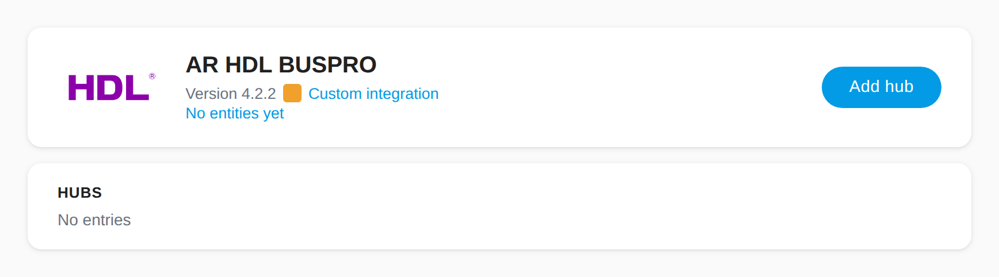
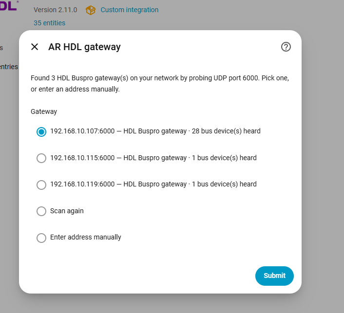
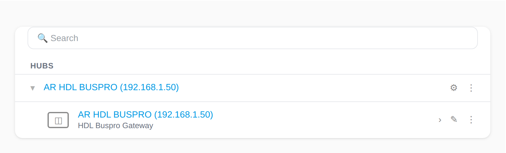
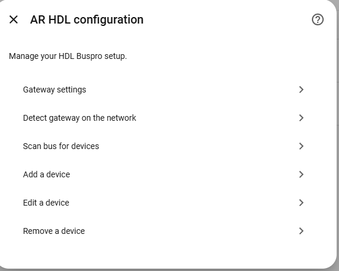
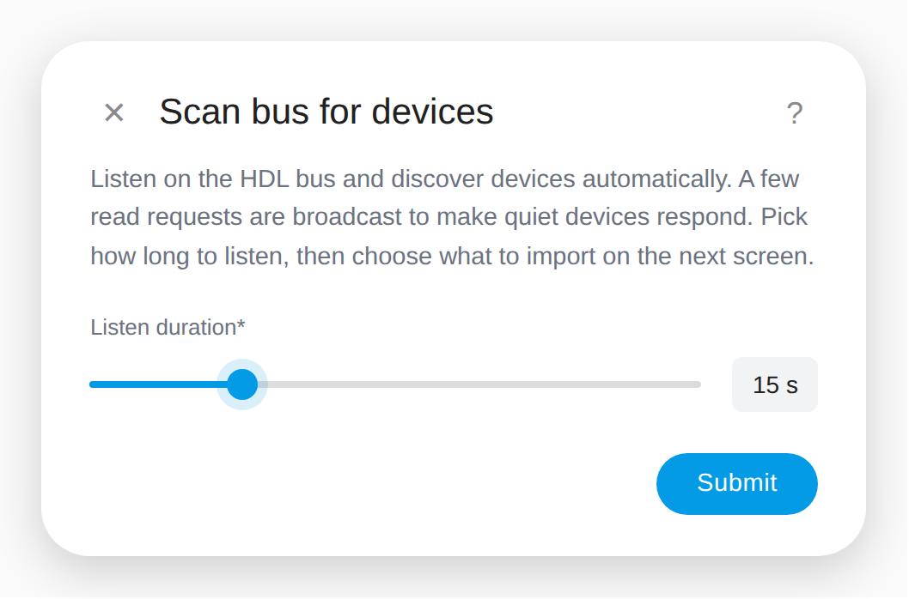
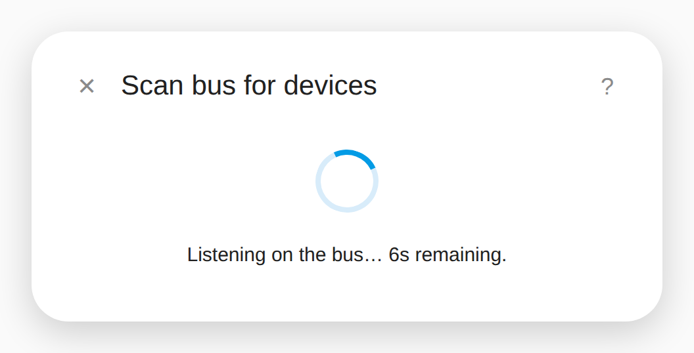
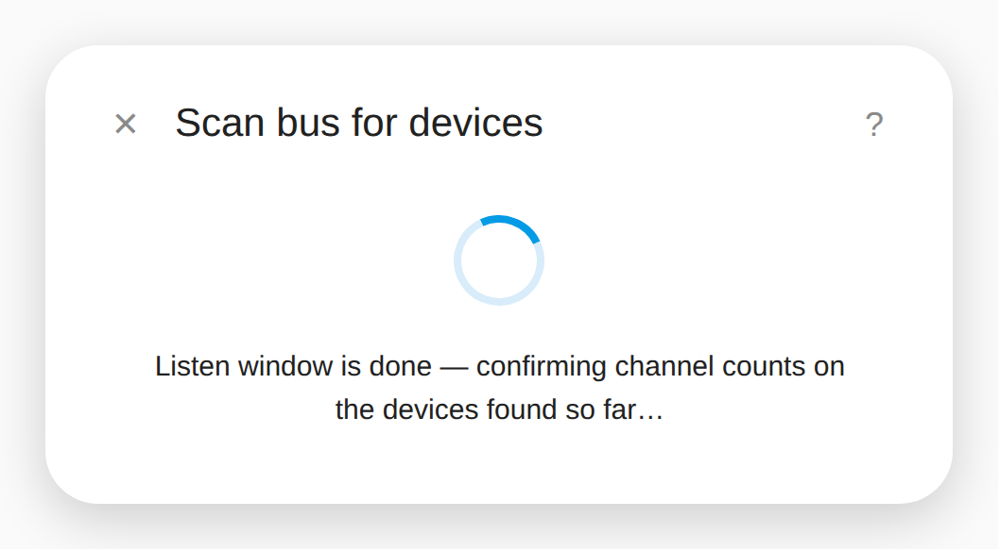
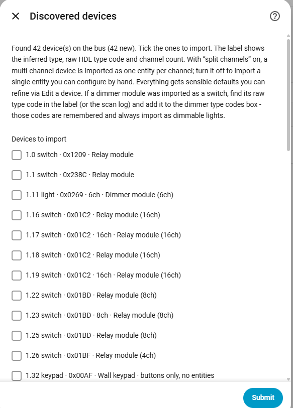

# 🏠 AR HDL BUSPRO — HDL Buspro for Home Assistant

[](https://my.home-assistant.io/redirect/hacs_repository/?owner=marsh4200&repository=ar_hdl_buspro&category=integration)
[](https://hacs.xyz)
[](https://github.com/marsh4200/ar_hdl_buspro/releases)
[](LICENSE)

Control an entire **HDL Buspro** installation from Home Assistant — lights, relays, curtains, floor heating, sensors and dry contacts — configured **entirely from the UI**. No YAML, no manual address hunting: point it at your gateway, press **Scan bus**, tick the devices you want, done.

Part of the **1PM-HDL** suite · [1pm.co.za](https://www.1pm.co.za/)

---

## 📚 Table of Contents

- [What you get](#what-you-get)
- [Supported platforms](#supported-platforms)
- [Installation](#installation)
- [Quick start (5 minutes)](#quick-start-5-minutes)
- [Setup walkthrough (with screenshots)](#-setup-walkthrough-with-screenshots)
- [Finding your gateway on the network](#finding-your-gateway-on-the-network)
- [Scanning the bus for devices](#scanning-the-bus-for-devices)
  - [How the scan works](#how-the-scan-works)
  - [Reading the results list](#reading-the-results-list)
  - [Split channels](#split-channels)
  - [Dimmer imported as a switch? Fix it in 10 seconds](#dimmer-imported-as-a-switch-fix-it-in-10-seconds)
  - [Curtain modules](#curtain-modules)
  - [Keypads and wall panels](#keypads-and-wall-panels)
  - [Re-scanning is always safe](#re-scanning-is-always-safe)
- [Adding and editing devices by hand](#adding-and-editing-devices-by-hand)
- [Recognised HDL type codes](#recognised-hdl-type-codes)
- [Services](#services)
- [How the connection works](#how-the-connection-works)
- [Troubleshooting](#troubleshooting)
- [Migrating from the legacy `buspro` integration](#migrating-from-the-legacy-buspro-integration)

---

## ✨ What You Get

| | |
|---|---|
| 🖱️ **UI-only setup** | Add the gateway once, then manage every device from the **Configure** menu |
| 📡 **Gateway auto-detection** | Broadcast probe on UDP/6000 finds every HDL gateway on the wire — even across IP subnets on the same switch. Pick from a list instead of typing an IP |
| 🔍 **Bus discovery** | One click scans the bus, identifies device types automatically, and imports them with sensible defaults |
| ✂️ **Per-channel splitting** | A 12-channel relay becomes 12 switches; a 6-channel dimmer becomes 6 lights; a 2-curtain module becomes 2 covers |
| 🛡️ **Source-IP filter** | Only telegrams from *your* gateway are processed, so other HDL systems on a shared network can't create phantom devices |
| 🔁 **Resilient connection** | Automatic reconnect with backoff if the UDP transport drops |
| 🩺 **Diagnostics** | Downloadable config-entry diagnostics with host redaction |

## 🔌 Supported Platforms

| Platform | HDL hardware | Notes |
|---|---|---|
| **Light** | Dimmer modules (MDT0601, DT0601, …) and relay channels | Dimmable or on/off, configurable ramp time |
| **Switch** | Relay modules (R0816, MR-family, …) | One entity per relay channel |
| **Cover** | Curtain modules (MW02 / MWM70B family) **and** relay-pair curtains | Real open / close / stop — see [Curtain modules](#curtain-modules) |
| **Climate** | Floor heating (6B0-10v, DLP panels) | Presets, optional relay feedback for heating-vs-idle state |
| **Sensor** | 12-in-1, 8-in-1, MSP07M sensors-in-one | Temperature and illuminance, broadcast + optional polling |
| **Binary sensor** | Motion, dry contacts, universal switches, channel status | Per-device scan interval |

## 📥 Installation

### HACS (recommended)

1. HACS → **Integrations** → ⋮ → **Custom repositories**
2. Add `https://github.com/marsh4200/ar_hdl_buspro` as an **Integration**
3. Install **AR HDL BUSPRO**, restart Home Assistant

### Manual

Copy `custom_components/ar_hdl_buspro` into your `config/custom_components/` folder and restart Home Assistant.

## 🚀 Quick Start (5 Minutes)

1. **Settings → Devices & Services → Add Integration → AR HDL BUSPRO**
2. The setup flow immediately broadcasts on the network and lists every HDL gateway it hears. **Pick yours** (or choose *Enter address manually*).
3. Confirm the details — port is normally `6000`. Leave *Local IP* blank unless you need to bind to a specific interface.
4. The entry is created straight away. Now open **Configure** on the integration card:

   ```
   AR HDL BUSPRO configuration
   ├── Gateway settings
   ├── Detect gateway on the network
   ├── Scan bus for devices      ← start here
   ├── Add a device
   ├── Edit a device
   └── Remove a device
   ```

5. Choose **Scan bus for devices**, keep the default listen duration, and press submit. Walk through the results (details below), tick everything you want, import. Your HDL system is now in Home Assistant.

---

## 📸 Setup Walkthrough (with Screenshots)

Seven screens from nothing to a working system — add the hub, pick the gateway, open settings, scan the bus, watch it work, and import.

> These are recreated at the current version (4.2.2) so the branding, text and behaviour you see below match what you'll actually get — they're not raw screen grabs off a live install (this repo doesn't ship with one), but every string is pulled straight from the integration's own `strings.json` and `config_flow.py`, so what's on screen is exactly what you'll see.

### Step 1 — Add the hub

<p align="center">
  
</p>

**Settings → Devices & Services → Add Integration → AR HDL BUSPRO**, then **Add hub**. Nothing to fill in yet — the next screen does the finding for you.

### Step 2 — Pick your gateway

<p align="center">
  
</p>

AR HDL BUSPRO probes UDP port 6000 and lists every HDL Buspro gateway that answers, each with the number of bus devices it heard — so if a site has more than one gateway, the busy one is obvious at a glance. Select yours and submit. There's also **Scan again** if the gateway was still booting, and **Enter address manually** if broadcasts are blocked on the network.

Confirm the details on the next screen — port is normally `6000`, and *Local IP* stays blank unless you need to bind the listener to a specific interface.

### Step 3 — Open the settings menu

<p align="center">
  
</p>

The hub is created immediately and appears under **Hubs** with its IP. Click the ⚙️ **gear icon** on the hub row — that's where everything else lives. (The device row beneath it is the gateway itself; the entities arrive once you've imported devices.)

### Step 4 — Run a bus scan

<p align="center">
  
</p>

The configuration menu is the control room for the whole integration:

| Option | What it's for |
|---|---|
| **Gateway settings** | Change host, port or local IP |
| **Detect gateway on the network** | Re-run the broadcast probe (new DHCP lease, moved VLAN) |
| **Scan bus for devices** | ⬅️ **Start here** — finds and imports your hardware |
| **Add a device** | Manual entry for anything the scan can't infer |
| **Edit a device** | Rename, change channel, dimmable flag, curtain number, presets… |
| **Remove a device** | Drops the entity (the physical device is untouched) |

Choose **Scan bus for devices** to carry on.

### Step 5 — Choose how long to sniff the bus

<p align="center">
  
</p>

The scan works by broadcasting read requests every few seconds and listening to everything that answers, so the listen duration is simply how long that window stays open:

| Duration | When to use it |
|---|---|
| **10–15 s** | Quick re-scan after adding a module or two — the default |
| **30 s** | First scan on a normal house; gives quiet devices time to reply |
| **45–60 s** | Large sites, or when you want to catch passive traffic — walk around pressing keypad buttons and dimming a few lights while it runs, so dimmers reveal themselves and keypads get identified |

Longer is never wrong, it just costs you the wait. Submit when you're happy.

### Step 6 — Watch it work

<p align="center">
  
  &nbsp;&nbsp;
  
</p>

While the listen window is open you get a live countdown instead of a blank spinner. When it hits `0s`, the dialog doesn't close right away — it switches to **confirming channel counts**: most relay and dimmer modules ignore a broadcast channel-status read and only answer one sent directly to their own address, so the integration follows up with every device it just found. That's normally a few extra seconds and is capped well beyond that on a very large bus, but it's what fills in the channel counts you see on the next screen — so let it finish.

### Step 7 — Select what you want to control

<p align="center">
  
</p>

Everything the bus answered with is listed for you to tick. Each line reads `address · inferred type · raw HDL type code · channel count · friendly name`, and anything already in your setup is marked so you can see at a glance what's new.

Before you import, two options are worth a look:

- **Split channels** (on by default) — turns a 12-channel relay into 12 individual switches and a 2-curtain module into 2 covers, so you can name each load properly. Turn it off only if you'd rather have one entity per physical module.
- **Dimmer type codes** — if a dimmer landed in the list as a switch, copy its type code from the line (e.g. `0x0269`) into this box before importing. The code is remembered for good, so every future scan on this site gets it right automatically.

Tick, submit, and your HDL system is in Home Assistant. Nothing is overwritten and nothing is deleted, so you can re-scan any time.

## 🌐 Finding Your Gateway on the Network

You never need to know the gateway's IP address up front.

HDL gateways broadcast on UDP port `6000` to `255.255.255.255`, which travels across IP-subnet boundaries as long as the devices share the same L2 switch. AR HDL BUSPRO exploits this in both directions:

- **During first setup** — the config flow sends a broadcast probe and lists every gateway that answers, with its IP and address. Select one and you're done.
- **Any time later** — *Configure → Detect gateway on the network* re-runs the same probe. Useful when the gateway got a new DHCP lease, you moved it to another VLAN, or you're standing in a client's plant room and don't know what the installer configured.

If nothing shows up, see [Troubleshooting](#troubleshooting) — it's almost always a firewall or a router between HA and the bus.

> 📸 The gateway picker is shown in [Step 2](#step-2--pick-your-gateway).

> **Tip — multiple HDL systems on one network:** detection will list *all* of them. The source-IP filter guarantees that once you pick a gateway, telegrams from the others are ignored, so neighbouring installations never bleed into your entity list.

## 🔍 Scanning the Bus for Devices

This is the headline feature. Instead of walking the site with the HDL Buspro Setup Tool writing down subnet/device/channel numbers, let the integration interrogate the bus for you.

**Configure → Scan bus for devices**

| Field | What it does |
|---|---|
| **Listen duration** | How long to listen on the bus, in seconds (default 15, range 3–60). Longer scans catch more passive traffic — 30–60 s is worth it on a large or quiet site. |

> 📸 The scan screens are shown in [Step 4](#step-4--run-a-bus-scan), [Step 5](#step-5--choose-how-long-to-sniff-the-bus), [Step 6](#step-6--watch-it-work) and [Step 7](#step-7--select-what-you-want-to-control).

### ⚙️ How the Scan Works

The scan runs in two phases, and the progress dialog (see [Step 6](#step-6--watch-it-work)) tells you which one you're in:

**Phase 1 — broadcast discovery**, for however long you set as the listen duration. During this window the scanner does two things at once:

1. **Provokes replies.** Every 2.5 s it broadcasts a round of read requests covering each device class — channel status, sensor status, sensors-in-one, floor heating, dry contacts, universal switches, curtain status (curtains 1 and 2), and the canonical HDL "device info" poke (`0x000E`). Anything alive on the bus answers at least one of these.
2. **Eavesdrops.** All other traffic during the window — keypad presses, dimmer broadcasts, sensor auto-reports — is also harvested. This is how keypads get identified (they *send* commands but never answer channel reads) and how dimmers betray themselves (any channel reporting an in-between level of 1–99 can only be a dimmer).

**Phase 2 — directed follow-up**, always runs after, and isn't part of the listen duration you set. Most relay and dimmer modules ignore a *broadcast* channel-status read and only answer one sent *directly* to their own address, so the scanner goes back to every device Phase 1 found and asks each one for its channel count, in two rounds a couple of seconds apart. This is normally a few seconds and is hard-capped at 20 seconds regardless of how many devices are on the bus, so a large site can't make the scan run away.

Each device that speaks is classified from **what it said**, which is far more reliable than the raw type code alone:

| The device replied with… | Classified as |
|---|---|
| Sensor / sensors-in-one status | Sensor (imported as a full temperature + lux + motion bundle) |
| Floor-heating status | Climate |
| Dry-contact status | Binary sensor |
| Curtain status (or echoed a keypad's curtain command) | **Cover** |
| Channel status, with dimmer evidence or a known dimmer type code | Light |
| Channel status, otherwise | Switch |
| Only ever *sent* commands, never answered a read | Keypad (labelled, not imported) |

Unknown hardware falls back to a switch on channel 1 — never lost, always editable afterwards.

### 📋 Reading the Results List

Each discovered device shows one line:

```
1.13  switch  ·  0x01AC  ·  12ch  ·  Relay module            ✓ in config
1.21  light   ·  0x026D  ·  6ch   ·  Dimmer module (6ch)
2.51  cover   ·  0x25E5  ·  2ch   ·  Curtain module
2.60  keypad  ·  0x00AF  ·  Wall keypad  ·  buttons only, no entities
```

Left to right: **bus address** (subnet.device), **inferred type**, **raw HDL type code**, **channel count**, **friendly name**. `✓ in config` means that address already exists in your setup — re-importing it is safe and only fills gaps.

### ✂️ Split Channels

**Split multi-channel devices into one entity per channel** (on by default) is what turns a `12ch` relay into 12 individual switches named `HDL 1.13 ch1` … `HDL 1.13 ch12`, ready to be renamed to *Kitchen Downlights* and friends. It applies to lights, switches **and** covers (one cover per curtain number).

Turn it off if you'd rather import a single entity per physical module and wire up channels by hand.

### 💡 Dimmer Imported as a Switch?

Dimmers are detected two ways: a known type code, or live evidence (a channel sitting at an in-between brightness during the scan). If every light on a dimmer happened to be fully off or fully on for the whole window, the module can land as a switch.

The fix is built into the results screen — the **Dimmer type codes** box:

1. Find the module's raw type code in its results line (e.g. `0x0269`).
2. Type it into the box (comma-separated for several: `0x0269, 0x0602`).
3. Import.

Those codes are **remembered permanently** — every future scan on this entry imports them as dimmable lights, no questions asked. This is how you teach the integration your site's hardware once and never think about it again.

### 🪟 Curtain Modules

Real HDL curtain modules (MW02 / MWM70B family, type codes `0x25E5`, `0x25E8`, …) are discovered via the curtain-status probe and imported as **cover** entities with proper **open / close / stop** — not as switches. A two-curtain module splits into two covers, one per curtain number.

These modules also get a **position slider**, using the same **travel time** field as relay-pair curtains (default 30 s, editable per device under *Edit a device*). This is an *estimate*, not a real percentage read back from the module — HDL's `CurtainSwitchControl` command has no percentage field on the wire. Opening and closing fully still work exactly as before (the module's own limit switches decide when to stop); a partial position drives the curtain and stops it after a proportionally-scaled delay, so accuracy depends on how close the configured travel time is to reality. If the curtain is moved by a wall switch, remote, or anything else outside Home Assistant, the estimate can drift — it resyncs to 0/100 the next time the module reports a real fully-open or fully-closed status.

The integration also supports the other common install style, **relay-pair curtains** — a motor hung off two relay channels (one drives open, one drives close) with a travel-time timer. The scan can't tell a curtain relay from a light relay, so relay-pair covers are set up by hand: *Add a device → Cover → mode: relay pair*, pick the open/close channels and travel time.

If your curtain module shows up with an unlisted type code, it will still classify as a cover as long as it answered the curtain probe — and you're welcome to open an issue with the code so it gets pinned in the table.

### 🎛️ Keypads and Wall Panels

Keypads are recognised (by type code, or by their traffic pattern: they command loads but never answer channel reads) and clearly labelled **`buttons only, no entities`**. They're deliberately excluded from import — a keypad has no controllable channels, so importing one would just create a dead switch. Their button presses arrive on the bus as ordinary scene/channel telegrams that act on the loads you *did* import.

### 🔄 Re-scanning is Always Safe

Import never deletes or overwrites anything. Existing (subnet, device, channel) combinations are skipped, so running a scan after adding new hardware only fills the gaps. Scan as often as you like.

## 🛠️ Adding and Editing Devices by Hand

Everything the scanner does, you can do manually — and everything it imports, you can refine:

- **Add a device** — pick a type (light, switch, cover, climate, sensor, binary sensor), fill in the subnet / device / channel and type-specific options.
- **Edit a device** — change any imported device's name, channel, dimmable flag, curtain number, cover mode, presets, scan interval, and so on.
- **Remove a device** — removes the entity; the physical device is of course untouched.

Per-device **scan interval** (sensors and binary sensors) enables active polling; `0` relies purely on bus broadcasts.

## 📖 Recognised HDL Type Codes

Codes already pinned in the classification table. Anything not listed still gets discovered — it classifies from its replies, or falls back to an editable switch.

| Code | Classified as | Hardware |
|---|---|---|
| `0x0011` | Climate | SB_DN_6B0-10v heating relay |
| `0x0086` / `0x0095` / `0x009C` | Climate | DLP / DLP2 panels |
| `0x0260` / `0x026D` / `0x0269` | Light (dimmer) | DT0601 / MDT0601 6-ch dimmers |
| `0x01AC`, `0x01BD`, `0x01BF`, `0x01C1`, `0x01C2`, `0x0141`, `0x0457`, `0x084D`, `0x1209`, `0x120B`, `0x238C`, `0x239C` | Switch | Relay modules (4/8/16 ch and mixed) |
| `0x25E5` / `0x25E8` | **Cover** | Curtain modules |
| `0x0077` | Binary sensor | SB_DRY_4Z dry contact |
| `0x0134` / `0x0135` / `0x0150` | Sensor bundle | 12-in-1 / 8-in-1 / MSP07M |
| `0x012B`, `0x00AF`, `0x08DB`, `0x080D` | Keypad | Wall panels (labelled, not imported) |

Found a code that isn't here? The scan log prints every device's type code — open an issue with the code and what the hardware is, and it gets added.

## 🔧 Services

### `ar_hdl_buspro.activate_scene`

```yaml
service: ar_hdl_buspro.activate_scene
data:
  address: [1, 74]        # subnet, device id
  scene_address: [3, 5]   # area, scene number
```

### `ar_hdl_buspro.set_universal_switch`

```yaml
service: ar_hdl_buspro.set_universal_switch
data:
  address: [1, 74]
  switch_number: 100
  status: 1               # 1 = on, 0 = off
```

### `ar_hdl_buspro.send_message` — raw telegram, for anything else

```yaml
# Example: single-channel control — channel 1 to 100% over 3 seconds
service: ar_hdl_buspro.send_message
data:
  address: [1, 74]
  operate_code: [0, 49]        # 0x0031 SingleChannelControl
  payload: [1, 100, 0, 3]      # channel, level %, running-time hi, lo
```

If HDL's protocol can say it, `send_message` can send it.

## 📡 How the Connection Works

- HDL Buspro over IP is **connectionless UDP** — the gateway can't be "pinged", so the config entry is created immediately and connectivity is reflected through entity availability.
- The integration binds UDP port `6000` to hear passive broadcasts. If something else on the host already owns 6000, it falls back to an ephemeral port: **commands still work**, but passive broadcasts from other bus devices are missed (polling still functions).
- The **source-IP filter** is installed automatically on connect and shown in diagnostics. It exists because HDL gateways broadcast everything to `255.255.255.255:6000`, which crosses IP-subnet boundaries on a shared L2 segment — without the filter, a neighbouring HDL system's traffic would appear as phantom devices.

## 🚨 Troubleshooting

| Symptom | Likely cause / fix |
|---|---|
| **Gateway detection finds nothing** | HA and the gateway must share an L2 segment for broadcasts to travel. Routed networks / VLANs block them — either allow UDP/6000 broadcast forwarding or use *Enter address manually*. Also check the host firewall isn't dropping UDP/6000. |
| **Scan finds nothing, but the gateway was detected** | The bus side may be quiet and something is eating the replies — verify no other Buspro software (HDL Setup Tool, another HA instance) is bound to port 6000 on the same host. Try a 60-second scan and press a few keypad buttons during it. |
| **Devices flicker unavailable** | Check the HA log for reconnect messages; the transport auto-recovers with backoff. Persistent drops usually mean duplicate IPs or a flaky switch port on the gateway. |
| **A dimmer imported as a switch** | Add its type code in the *Dimmer type codes* box on the scan results screen — see [above](#dimmer-imported-as-a-switch-fix-it-in-10-seconds). |
| **A curtain module imported as a switch** | Re-scan with this version — curtain modules are probed directly and classify as covers. If it still lands wrong, its type code isn't answering the curtain probe; open an issue with the code from the scan log. |
| **Phantom devices from a neighbour's HDL system** | Shouldn't happen — the source-IP filter drops them. Check diagnostics to confirm the filter shows your gateway's IP. |
| **Entities respond but sensor broadcasts never arrive** | Port 6000 fallback is in effect (see [How the connection works](#how-the-connection-works)). Free up UDP/6000 on the host, or set a per-device scan interval to poll instead. |

## 🔄 Migrating from the Legacy `buspro` Integration

Legacy `buspro` entries (`host` / `port`) are migrated automatically to the new schema on first load. Your entities keep working; from there, use **Scan bus for devices** to pull in everything the old integration couldn't do.

---

· Issues and type-code contributions welcome on [GitHub](https://github.com/marsh4200/ar_hdl_buspro/issues)

---

## ❤️ Support the Project

If you find **AR HDL BUSPRO** useful:

- ⭐ Star this repository
- 🐛 Report bugs
- 💡 Suggest features
- 🤝 Contribute improvements

