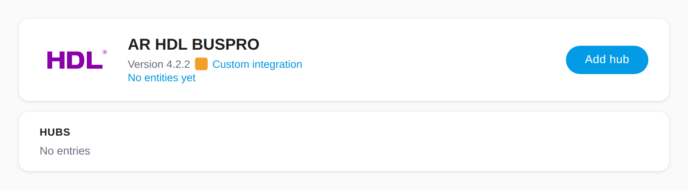
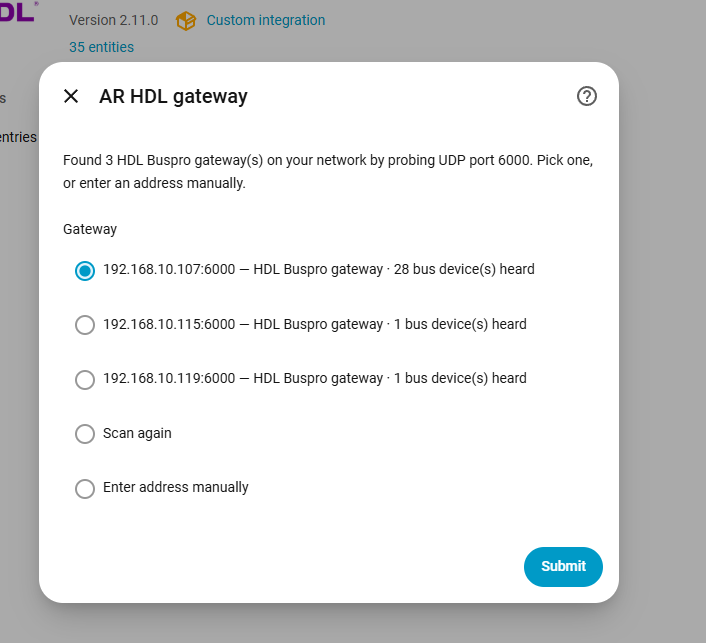
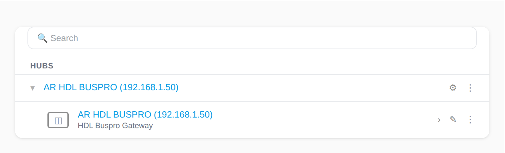
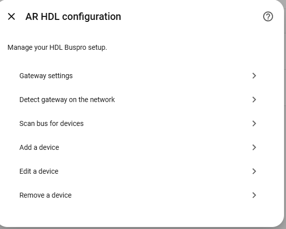
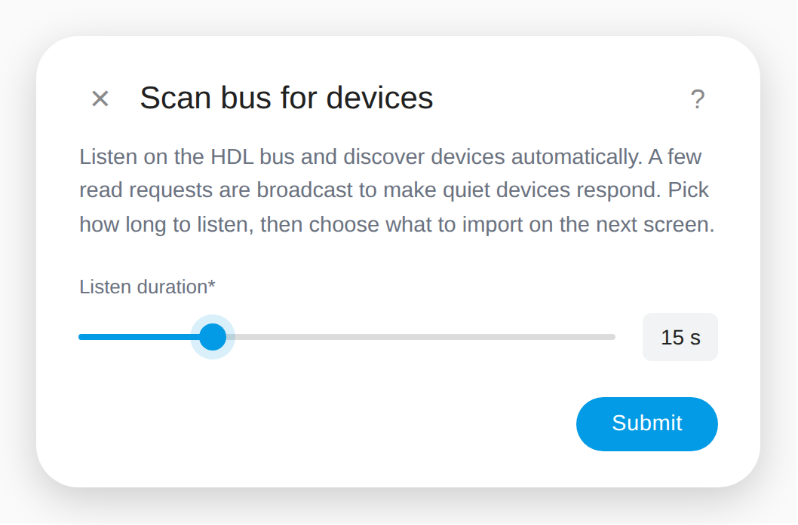
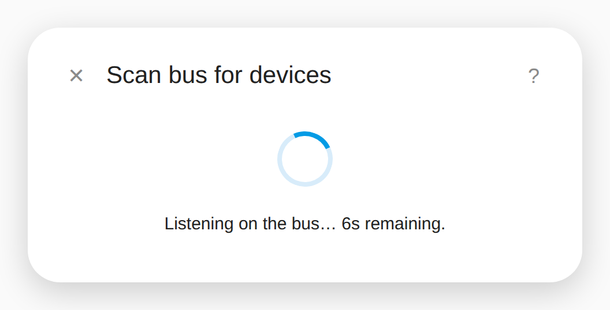
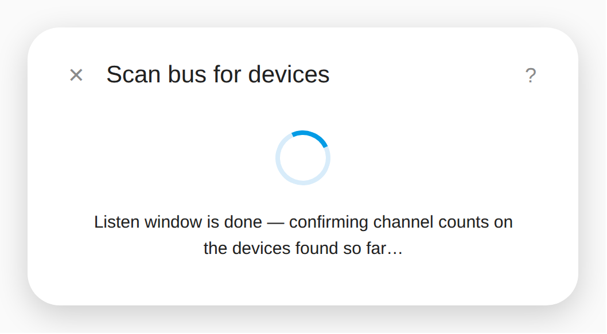
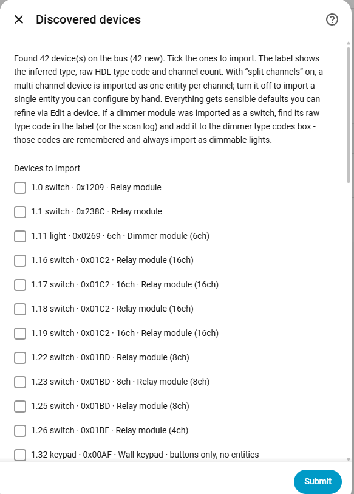

# HDL Buspro for Home Assistant

[](https://my.home-assistant.io/redirect/hacs_repository/?owner=marsh4200&repository=ar_hdl_buspro&category=integration)
[](https://hacs.xyz)
[](https://github.com/marsh4200/ar_hdl_buspro/releases)
[](LICENSE)

Control an entire **HDL Buspro** installation from Home Assistant: lights, relays, curtains, floor heating, air conditioning, sensors, dry contacts and wireless Buspro panels, all configured **from the UI**. No YAML and no hunting for addresses: point it at your gateway, press **Scan bus**, tick the devices you want, done.

The scan recognises your hardware for you. Devices that can describe themselves report what they are and how many channels they have, and everything else is matched against a built-in catalogue of **~1,800 HDL device types**.

Part of the **1PM-HDL** suite · [1pm.co.za](https://www.1pm.co.za/)

---

## 📚 Table of Contents

- [What's new in 5.0.11](#-whats-new-in-5011)
- [What you get](#-what-you-get)
- [Supported platforms](#-supported-platforms)
- [Installation](#-installation)
- [Quick start (5 minutes)](#-quick-start-5-minutes)
- [Setup walkthrough (with screenshots)](#-setup-walkthrough-with-screenshots)
- [Finding your gateway on the network](#-finding-your-gateway-on-the-network)
- [Scanning the bus for devices](#-scanning-the-bus-for-devices)
  - [How the scan works](#️-how-the-scan-works)
  - [How a device is identified](#-how-a-device-is-identified)
  - [Reading the results list](#-reading-the-results-list)
  - [Split channels](#️-split-channels)
  - [Dimmer imported as a switch?](#-dimmer-imported-as-a-switch)
  - [Curtain modules](#-curtain-modules)
  - [Keypads, panels, gateways and logic modules](#️-keypads-panels-gateways-and-logic-modules)
  - [Re-scanning is always safe](#-re-scanning-is-always-safe)
- [Keypad LED sync](#-keypad-led-sync)
- [Keypad buttons in Home Assistant](#-keypad-buttons-in-home-assistant)
- [Buspro wireless panels](#-buspro-wireless-panels)
- [Sensors, temperature and humidity](#️-sensors-temperature-and-humidity)
- [Adding and editing devices by hand](#️-adding-and-editing-devices-by-hand)
- [Air conditioning via an IR module](#️-air-conditioning-via-an-ir-module)
- [Air conditioning via a touch panel](#️-air-conditioning-via-a-touch-panel)
- [Recognised HDL type codes](#-recognised-hdl-type-codes)
- [Services](#-services)
- [How the connection works](#-how-the-connection-works)
- [Debug logging](#-debug-logging)
- [Troubleshooting](#-troubleshooting)
- [Upgrading](#-upgrading)
- [Migrating from the legacy `buspro` integration](#-migrating-from-the-legacy-buspro-integration)
- [Licensing](#licensing)

---

## 🆕 What's New in 5.0.11

- **Automatic device identification.** Supported HDL hardware now describes itself during the bus scan (what it is and how many relays, dimmers, curtains or inputs it has), and a built-in catalogue of ~1,800 HDL device types names and classifies everything else. Silent relay and dimmer modules import all their channels, not just channel 1.
- **Keypad buttons in Home Assistant.** A spare keypad button (one with no relay behind it) can be programmed to talk to Home Assistant, appearing as an on/off switch and firing an event on every press for automations. See [Keypad buttons in Home Assistant](#-keypad-buttons-in-home-assistant).
- **Keypad LED sync.** Keypad button LEDs now follow the relays they control, even when the relay is switched from Home Assistant. Works for wired keypads and Buspro wireless panels. See [Keypad LED sync](#-keypad-led-sync).
- **Humidity on touch panels.** Granite Display and 4" touch panels now report humidity as well as temperature, and both sensors are added automatically when the panel is imported.
- **HDL-MRCU home control unit** imports its 4 dimmer channels as dimmable lights automatically.
- **Wireless Buspro panels** import their built-in relays, and the 1-relay and 3-relay versions of `0x13C2` are told apart when the panel reports its relay count.
- **Corrected device types.** `0x0011` is a 6-channel 0-10V dimmer, `0x0141` a 12-in-1 sensor, `0x1209` / `0x120B` IP gateways and `0x0457` a logic module. Gateways and logic modules are labelled and left out of import.
- **Less bus traffic.** Devices that never answer a status request are no longer asked every 20 seconds forever: they get a few quick retries, then a slow background check.

Sorry to anyone who had devices come in as the wrong type on earlier versions. See [Upgrading](#-upgrading) for how to bring an existing install up to date.

## ✨ What You Get

| | |
|---|---|
| 🖱️ **UI-only setup** | Add the gateway once, then manage every device from the **Configure** menu |
| 📡 **Gateway auto-detection** | A broadcast probe on UDP/6000 finds every HDL gateway on the wire, even across IP subnets on the same switch. Pick from a list instead of typing an IP |
| 🔍 **Bus discovery** | One scan finds every device on the bus, identifies it automatically and imports it with sensible defaults |
| 🧠 **Automatic identification** | Self-describing hardware reports its own type and channel layout; everything else is matched against ~1,800 known HDL device types |
| ✂️ **Per-channel splitting** | A 12-channel relay becomes 12 switches, a 6-channel dimmer 6 lights, a 2-curtain module 2 covers, and an MRCU its relays *and* dimmers |
| 💡 **Keypad LED sync** | Keypad button LEDs stay in step with relays switched from Home Assistant |
| 🛡️ **Source-IP filter** | Only telegrams from *your* gateway are processed, so other HDL systems on a shared network can't create phantom devices |
| 🔁 **Resilient connection** | Automatic reconnect with backoff if the UDP transport drops |
| 🩺 **Diagnostics** | Downloadable config-entry diagnostics with host redaction |

## 🔌 Supported Platforms

| Platform | HDL hardware | Notes |
|---|---|---|
| **Light** | Dimmer modules (MDT0601, MD0602, MRDA06 0-10V, …), MRCU dimmer channels, relay channels | Dimmable or on/off, configurable ramp time, keypad LED sync |
| **Switch** | Relay modules (MR0410, MR0816, MR1210, MR1616, …), MRCU relays, Buspro wireless panels with built-in relays | One entity per relay channel, keypad LED sync |
| **Universal switch** | IR modules (HDL-MIRC04.40) and any universal-switch number | Virtual on/off flags for scenes and logic |
| **Keypad button** | Any spare keypad button sending a universal switch to Home Assistant | On/off switch + press event for automations |
| **Cover** | Curtain modules (MW02 / MWM / MVSM families) **and** relay-pair curtains | Open / close / stop plus an estimated position. See [Curtain modules](#-curtain-modules) |
| **Climate** | Floor heating (DLP panels), air conditioners via an IR module, air conditioners via a touch panel | See the AC sections below |
| **Sensor** | 12-in-1, 8-in-1, 7-in-1 / MSP07M sensors-in-one, temperature sensors, touch-panel temperature and humidity | Broadcast plus optional polling |
| **Binary sensor** | Motion, dry-contact zones, universal switches, channel status | One entity per dry-contact zone |

## 📥 Installation

### HACS (recommended)

1. HACS → **Integrations** → ⋮ → **Custom repositories**
2. Add `https://github.com/marsh4200/ar_hdl_buspro` as an **Integration**
3. Install **AR HDL BUSPRO**, then restart Home Assistant

### Manual

Copy `custom_components/ar_hdl_buspro` into your `config/custom_components/` folder and restart Home Assistant.

## 🚀 Quick Start (5 Minutes)

1. **Settings → Devices & Services → Add Integration → AR HDL BUSPRO**
2. The setup flow immediately broadcasts on the network and lists every HDL gateway it hears. **Pick yours** (or choose *Enter address manually*).
3. Confirm the details. The port is normally `6000`; leave *Local IP* blank unless you need to bind to a specific interface.
4. The entry is created straight away. Now open **Configure** on the integration card:

   ```
   AR HDL BUSPRO configuration
   ├── Gateway settings
   ├── Detect gateway on the network
   ├── Scan bus for devices      ← start here
   ├── Add a device
   ├── Edit a device
   └── Remove a device
   ```

5. Choose **Scan bus for devices**, keep the default listen duration and press submit. Tick everything you want in the results and import. Your HDL system is now in Home Assistant.

---

## 📸 Setup Walkthrough (with Screenshots)

Seven screens from nothing to a working system: add the hub, pick the gateway, open settings, scan the bus, watch it work, and import.

> These screens are recreated from the integration's own text and flow rather than grabbed off a live install, so the wording matches what you'll see. Labels in the scan results now also show HDL model names.

### Step 1 — Add the hub

<p align="center">
  
</p>

**Settings → Devices & Services → Add Integration → AR HDL BUSPRO**, then **Add hub**. Nothing to fill in yet; the next screen does the finding for you.

### Step 2 — Pick your gateway

<p align="center">
  
</p>

AR HDL BUSPRO probes UDP port 6000 and lists every HDL Buspro gateway that answers, each with the number of bus devices it heard. If a site has more than one gateway, the busy one is obvious at a glance. Select yours and submit. There's also **Scan again** if the gateway was still booting, and **Enter address manually** if broadcasts are blocked on the network.

Confirm the details on the next screen. The port is normally `6000`, and *Local IP* stays blank unless you need to bind the listener to a specific interface.

### Step 3 — Open the settings menu

<p align="center">
  
</p>

The hub is created immediately and appears under **Hubs** with its IP. Click the ⚙️ **gear icon** on the hub row; that's where everything else lives. The device row beneath it is the gateway itself; the entities arrive once you've imported devices.

### Step 4 — Run a bus scan

<p align="center">
  
</p>

| Option | What it's for |
|---|---|
| **Gateway settings** | Change host, port or local IP |
| **Detect gateway on the network** | Re-run the broadcast probe (new DHCP lease, moved VLAN) |
| **Scan bus for devices** | ⬅️ **Start here**: finds, identifies and imports your hardware |
| **Add a device** | Manual entry for anything the scan can't reach |
| **Edit a device** | Rename, change channel, dimmable flag, curtain number, keypad LED buttons, presets… |
| **Remove a device** | Drops the entity (the physical device is untouched) |

### Step 5 — Choose how long to listen

<p align="center">
  
</p>

| Duration | When to use it |
|---|---|
| **10–15 s** | Quick re-scan after adding a module or two (the default) |
| **30 s** | First scan on a normal house; gives quiet devices time to reply |
| **45–60 s** | Large sites, or to catch passive traffic. Press a few keypad buttons and dim some lights while it runs |

Longer is never wrong, it just costs you the wait.

### Step 6 — Watch it work

<p align="center">
  
  &nbsp;&nbsp;
  
</p>

While the listen window is open you get a live countdown. When it reaches `0s`, the dialog switches to **confirming**: the integration follows up directly with every device it found to confirm channel counts, identify unknown hardware and read keypad programming. Let it finish; on a normal site it takes a few extra seconds, and it is hard-capped on very large buses.

### Step 7 — Select what you want to control

<p align="center">
  
</p>

Everything the bus answered with is listed for you to tick, and anything already in your setup is marked so you can see what's new. Two options are worth a look before you import:

- **Split channels** (on by default) turns a 12-channel relay into 12 individual switches and a 2-curtain module into 2 covers, so you can name each load properly.
- **Dimmer type codes**: if a dimmer landed in the list as a switch, copy its type code (e.g. `0x0269`) into this box. The code is remembered for good.

Tick, submit, and your HDL system is in Home Assistant. Nothing is overwritten or deleted, so you can re-scan any time.

## 🌐 Finding Your Gateway on the Network

You never need to know the gateway's IP address up front.

HDL gateways broadcast on UDP port `6000` to `255.255.255.255`, which crosses IP-subnet boundaries as long as the devices share the same L2 switch. AR HDL BUSPRO uses this in both directions:

- **During first setup**, the config flow sends a broadcast probe and lists every gateway that answers. Select one and you're done.
- **Any time later**, *Configure → Detect gateway on the network* re-runs the same probe. Useful when the gateway got a new DHCP lease, moved to another VLAN, or you're on a site and don't know what the installer configured.

> **Tip — multiple HDL systems on one network:** detection lists *all* of them. Once you pick a gateway, the source-IP filter ignores telegrams from the others, so neighbouring installations never leak into your entity list.

## 🔍 Scanning the Bus for Devices

Instead of walking the site with the HDL Buspro Setup Tool writing down subnet, device and channel numbers, let the integration interrogate the bus for you.

**Configure → Scan bus for devices**

| Field | What it does |
|---|---|
| **Listen duration** | How long to listen on the bus, in seconds (default 15, range 3–60). Longer scans catch more passive traffic. |

### ⚙️ How the Scan Works

**Phase 1 — broadcast discovery**, for the listen duration you set:

1. **Provokes replies.** Every 2.5 s it broadcasts a round of read requests covering every device class: channel status, sensors, sensors-in-one, motion, panel temperature, floor heating, dry contacts, universal switches, curtains, the device name, and HDL's "read device module" request (`0xE548`) that self-describing hardware answers with its own function list.
2. **Listens.** All other traffic in the window (keypad presses, dimmer broadcasts, sensor reports) is harvested too.

**Phase 2 — directed follow-up.** Most relay and dimmer modules only answer a channel-status read sent directly to their own address, so the scanner asks each device it found for its channel count.

**Phase 3 — identification.** Every device that hasn't described itself yet is asked directly, once per protocol, what it is, and its name (the remark set in the HDL Setup Tool) is read so imported entities carry real names.

**Phase 4 — keypad programming.** Keypads and panels are asked what each button is programmed to do, so relays can be linked to the buttons that drive them for [Keypad LED sync](#-keypad-led-sync).

Every phase after the listen window is time-capped, so a large site can't make the scan run away.

### 🧠 How a Device Is Identified

Each device is classified using the most reliable information available, in this order:

| Priority | Source | Example |
|---|---|---|
| 1 | **Confirmed codes** pinned in the integration (from real installations) | `0x01BD` → 8-channel relay |
| 2 | **The device's own description** (its reply to `0xE548`) | "2 buttons + 1 relay" |
| 3 | **HDL device catalogue** (~1,800 type codes: model, family, channel layout) | `0x01C0` → HDL-MR0810, 8 relays |
| 4 | **What the device answered** during the scan | Answered a curtain read → cover |

A device that answers a channel-status read is never overruled by the catalogue, so real hardware always wins over a lookup. Panels still follow what they answer: a panel that reports floor heating becomes a climate device, one that reports an onboard temperature becomes a sensor.

| The device answered… | Classified as |
|---|---|
| Sensor / sensors-in-one status | Sensor (temperature + lux + motion bundle, humidity where fitted) |
| Floor-heating status | Climate |
| Panel temperature only | Sensor (temperature, plus humidity on touch panels) |
| Dry-contact status | Binary sensor (one per zone) |
| Curtain status | **Cover** |
| Channel status, with dimmer evidence or a dimmer type code | Light |
| Channel status, otherwise | Switch |
| Only ever *sent* commands | Keypad (labelled, not imported) |

Unknown hardware falls back to a switch on channel 1: never lost, always editable afterwards.

### 📋 Reading the Results List

```
1.13  switch  ·  0x01C1  ·  12ch  ·  Relay module                          ✓ in config
1.21  light   ·  0x026D  ·  6ch   ·  Dimmer module (6ch)
1.37  switch  ·  0x0DCE  ·  18 relay + 4 dimmer  ·  Home control unit (HDL-MRCU)
2.1   switch  ·  "Lounge"  ·  0x13C3  ·  3ch  ·  Wireless relay panel (3 relays)
2.51  cover   ·  0x02C9  ·  2ch   ·  Curtain module (2ch, HDL-MW02.431)
2.60  keypad  ·  0x00AF  ·  Wall keypad  ·  buttons only, no entities
1.38  gateway ·  0x1209  ·  IP gateway (HDL-MBUS01IP.431)  ·  no entities
```

Left to right: **bus address** (subnet.device), **classified type**, the device's **name** if it has one, **HDL type code**, **channels**, and the **model**. Where a device described itself, its own function list is shown in brackets, e.g. `[2 button + 1 relay]`. `✓ in config` means that address already exists in your setup; re-importing it only fills gaps.

### ✂️ Split Channels

**Split channels** (on by default) turns a `12ch` relay into 12 switches named `HDL 1.13 ch1` … `HDL 1.13 ch12`, ready to rename. It applies to lights, switches and covers. Mixed modules come in per channel with the right type each: an HDL-MRCU imports channels 1–17 and 22 as switches and 18–21 as dimmable lights.

Turn it off if you'd rather import a single entity per physical module.

### 💡 Dimmer Imported as a Switch?

Most dimmers are now recognised from the catalogue. If one still lands as a switch:

1. Find its type code in the results line (e.g. `0x0269`).
2. Type it into the **Dimmer type codes** box (comma-separated for several: `0x0269, 0x0602`).
3. Import.

Those codes are **remembered permanently** for every future scan on this entry.

### 🪟 Curtain Modules

HDL curtain modules (MW02, MWM and MVSM families) are imported as **cover** entities with **open / close / stop**. A two-curtain module splits into two covers.

They also get a **position slider**, driven by the **travel time** field (default 30 s, editable per device). This is an *estimate*: HDL's curtain command has no percentage field. Fully open and fully closed always work exactly (the module's limit switches decide), and the estimate resyncs whenever the module reports a real fully-open or fully-closed status.

**Recalibrate via nearest endpoint before repositioning** (off by default) first runs to the nearer endpoint, then travels to the requested position. Turn it on under *Edit a device*.

**Relay-pair curtains** (a motor on two relay channels plus a travel timer) are set up by hand: *Add a device → Cover → mode: relay pair*.

### 🎛️ Keypads, Panels, Gateways and Logic Modules

- **Keypads and wall panels** are labelled **`buttons only, no entities`** and left out of import. Their button presses act on the loads you *did* import, and their LEDs are kept in step by [Keypad LED sync](#-keypad-led-sync).
- **Buspro wireless panels** are the exception: they have relays built in, so they import as switches. See [Buspro wireless panels](#-buspro-wireless-panels).
- **Gateways and logic modules** (IP gateways, mesh gateways, logic timers) are labelled **`no entities`** and left out of import.

### 🔄 Re-scanning Is Always Safe

Import never deletes or overwrites a device. Existing (subnet, device, channel) combinations are skipped, so a scan after adding new hardware only fills the gaps. Each scan also refreshes keypad LED links for the keypads it could read.

## 💡 Keypad LED Sync

An HDL keypad's button LED shows the button's own state, not the relay's. When a relay is switched from Home Assistant, another keypad or HDL logic, the keypad that normally drives it isn't told, so its LED goes out of step.

AR HDL BUSPRO keeps them in step automatically:

- **The bus scan reads each keypad's button programming**, from wired keypads and Buspro wireless panels alike, and links every button that switches a **single** relay or dimmer channel to that entity, exactly as programmed in the HDL software.
- **Whenever that channel changes**, from Home Assistant or anywhere else on the bus, the linked buttons' LEDs are set to match.
- It works for keypads driving a separate relay module, and for wireless panels driving their own built-in relays. A wireless panel whose buttons can't be read falls back to button N = relay N.
- Buttons that drive **several** channels at once (an "all lights" button, for example) are left unlinked, because their LED doesn't belong to any one channel.

Links are shown on each relay and light under **Configure → Edit a device → Keypad LED buttons**, written as `subnet.device:button` and separated by commas:

```
2.1:2              # button 2 on the panel at 2.1
2.1:2, 1.50:4      # two keypads (two-way switching)
```

You can add, change or clear them by hand at any time. Leave the field empty to turn LED sync off for that entity.

## 🔘 Keypad Buttons in Home Assistant

A keypad often has more buttons than loads, e.g. a 4-button panel with 3 relays. A spare button can be turned into a **trigger for Home Assistant**: it shows up as an on/off switch, toggles with each press, and fires an event your automations can use.

Home Assistant answers on the bus at its own address, **`250.250`**. Point the spare button at it:

**1. In the HDL software**, select the keypad and the spare button, then:

| Setting | Value |
|---|---|
| Button type | **Single ON/OFF** |
| Target | **one** target only — delete any others |
| Type | **Universal Switch** |
| Subnet ID / Device ID | **250** / **250** (Home Assistant) |
| Switch no. | any free number, e.g. **200** (use a different number per button) |
| Switch status | leave as is (Single ON/OFF alternates on/off itself) |

Save it to the keypad.

**2. In Home Assistant**, run **Scan bus for devices** and press submit. The scan reads the button's programming and creates a **keypad button** entity for it, already linked to the button's LED. To add one by hand instead: *Add a device → Keypad button*, switch number `200`, Keypad LED buttons `subnet.device:button` (e.g. `2.1:4`).

**What you get:**
- **Press the button** → the entity flips on/off, the button LED stays lit or off as normal (Home Assistant confirms the command, so the keypad doesn't flash), and an `ar_hdl_buspro_keypad_button` event fires.
- **Toggle the entity in Home Assistant** → the button's LED turns on/off to match.
- The state survives a Home Assistant restart.

Nothing is switched on the bus. It's a trigger, so wire it to whatever you like with an automation:

```yaml
triggers:
  - trigger: event
    event_type: ar_hdl_buspro_keypad_button
    event_data:
      switch_number: 200
      state: "on"        # or "off"; leave out to fire on every press
actions:
  - action: scene.turn_on
    target:
      entity_id: scene.movie_night
```

Or trigger on the keypad button entity's state changing like any other switch. Several keypads can share one switch number (e.g. a button at each door), and they stay in step.

> If the button's LED **flashes three times and goes off** when pressed, the keypad isn't getting Home Assistant's confirmation: check the target is `250.250`, the integration is running and licensed, and the gateway is reachable.

## 📶 Buspro Wireless Panels

Buspro wireless wall panels (`0x1391`, `0x13C2`, `0x13C3`) have relays built in behind the switch, usually with more buttons than relays. They import as **one switch per relay**, and their button LEDs are kept in step by [Keypad LED sync](#-keypad-led-sync).

- `0x1391` and `0x13C3` import 3 relays.
- `0x13C2` is sold with **1 or 3 relays** under the same code. If the panel reports its own relay count during the scan, that count is used; otherwise it imports 3, and you can delete the unused channels on a 1-relay panel.

Wireless panels don't answer HDL's channel-status read, so their on/off state in Home Assistant comes from switching events. They're asked a few times after a restart and then left alone instead of being polled forever.

## 🌡️ Sensors, Temperature and Humidity

Multi-sensors are imported as a **bundle** under one device: temperature, illuminance and motion, plus humidity where the sensor has it.

| Hardware | Readings |
|---|---|
| 12-in-1 (HDL-MS12.2C) | Temperature, lux, motion |
| 8-in-1 (HDL-MS08M.2C) | Temperature, lux, motion |
| 7-in-1 / MSP07M sensors-in-one | Temperature, lux, motion, humidity (when the sensor reports it) |
| Granite Display / 4" touch panels | Temperature and **humidity** |
| HDL-MTS04 temperature sensor | Temperature |

**Touch-panel humidity:** Granite Display and 4" touch panels report humidity through HDL's analog-value read, the same way HDL's own software reads it. Importing a Granite Display adds its temperature and humidity sensors automatically. To add one by hand: *Add a device → Sensor*, the panel's address, sensor kind **humidity**, hardware kind **panel**.

Each sensor entity exposes `last_telegram` and `raw_payload` attributes, so you can see exactly what the hardware sent if a reading looks wrong.

## 🛠️ Adding and Editing Devices by Hand

Everything the scanner does you can do manually, and everything it imports you can refine:

- **Add a device**: pick a type (light, switch, universal switch, cover, climate, sensor, binary sensor) and fill in the subnet / device / channel and type-specific options.
- **Edit a device**: change name, channel, dimmable flag, curtain number, cover mode, presets, scan interval, keypad LED buttons, and so on.
- **Remove a device**: removes the entity; the physical device is untouched.

A per-device **scan interval** (sensors and binary sensors) enables active polling; `0` relies on bus broadcasts only.

## ❄️ Air Conditioning via an IR Module

HDL IR emitter modules like the **HDL-MIRC04.40** have 4 "live AC panel" channels, each able to control one air conditioner directly. AR HDL BUSPRO controls these as full climate entities: power, HVAC mode, fan speed and target temperature.

The scan doesn't find these; add them by hand:

1. **Configure → Add a device → Climate**
2. Fill in the **module's** subnet/device address (not the AC unit's)
3. Set **Climate protocol** to *Air conditioner via IR module*
4. Set **HVAC No.** (1–4), the module's AC channel for this unit
5. Repeat for each AC unit, one entity per HVAC No.

**Modes:** Cool, Heat, Fan only, Auto, Dry. **Fan speeds:** Auto, Low, Medium, High. If a unit lacks a mode (a cooling-only split, say), narrow **AC HVAC modes to offer** under *Edit a device*.

> Mapped from real bus captures ([issue #17](https://github.com/marsh4200/ar_hdl_buspro/issues/17)) and cross-checked against HDL's AC control specification. If something doesn't behave as expected, please open an issue with a [debug log](#-debug-logging).

## 🌡️ Air Conditioning via a Touch Panel

HDL touch panels with an AC page (**HDL-MPTL4C.48 Granite Display**, **HDL-MPTLC43.46-A Enviro** and the same family) can be controlled directly: power, Cool/Heat, fan speed and target temperature, with the room temperature from the panel's own sensor. Changes made on the panel's screen show up in Home Assistant straight away.

1. **Configure → Add a device → Climate**
2. Fill in the **panel's** subnet/device address
3. Set **Climate protocol** to *Air conditioner via touch panel*
4. Set **HVAC No.** to the panel's AC slot (AC 1 = 1, AC 2 = 2, …)
5. Leave **Temperature channel** at `1` (the panel's built-in sensor), or `0` for none

**Modes:** Cool, Heat. **Fan speeds:** Auto, Low, Medium, High. **Setpoint range:** 16–30 °C. Swing and the panel's own setpoint limits aren't supported yet.

## 📖 Recognised HDL Type Codes

These codes are confirmed from real installations and always take priority. Anything not listed is still identified automatically (see [How a device is identified](#-how-a-device-is-identified)).

| Code | Classified as | Hardware |
|---|---|---|
| `0x0095` / `0x009C` | Climate | DLP panels |
| `0x0086` | Sensor or Climate | HDL-MTS04.20 4-ch temperature sensor on HDL, DLP2 panel on Smart-Bus; decided by what the device answers |
| `0x0890` | Climate | HDL-MPTL4C.48 Granite Display; also imports its temperature and humidity sensors |
| `0x0260` / `0x026D` / `0x0269` / `0x027E` | Light (dimmer) | MDT0601 / MD0602 / MDT06015 6-ch dimmers |
| `0x0011` | Light (dimmer) | HDL-MRDA06 / SB-DN-6B0-10v 6-ch 0-10V dimmer |
| `0x164B` | Light (dimmer) | HDL-MPD01-RF.28 1-ch wireless dimmer |
| `0x01AC`, `0x01BD`, `0x01BF`, `0x01C1`, `0x01C2` | Switch | Relay modules (4 / 8 / 12 / 16 ch) |
| `0x0DCE` | Switch + Light | HDL-MRCU home control unit: channels 1–17 and 22 as switches, 18–21 as dimmable lights |
| `0x1391` / `0x13C3` / `0x13C2` | Switch | Buspro wireless panels with built-in relays (see [Buspro wireless panels](#-buspro-wireless-panels)) |
| `0x1589` / `0x158A` | Switch | HDL-MPR01-RF.28 1-ch / HDL-MPR02-RF.28 2-ch wireless relays |
| `0x25E5` / `0x25E8` / `0x02C9` | **Cover** | Curtain motors and HDL-MW02.431 2-ch curtain module |
| `0x0073` / `0x0077` / `0x0166` | Binary sensor | 4-zone and 24-zone dry-contact modules |
| `0x0134` / `0x0141` / `0x0135` | Sensor bundle | 12-in-1 (HDL-MS12.2C) / 8-in-1 |
| `0x0138` / `0x0148` / `0x0150` | Sensor bundle | 7-in-1 / MSP07M sensors-in-one |
| `0x0516` / `0x0517` | Universal switch | HDL-MIRC04.40 IR emitter/receiver module |
| `0x012B`, `0x00AF`, `0x08DB`, `0x080D`, `0x084D`, `0x239C`, `0x238C`, `0x08CA` | Keypad | Wall keypads, DLP panels and Granite Display keypads (labelled, not imported) |
| `0x02F5` / `0x1209` / `0x120B` / `0x0455` / `0x0457` | Gateway / Logic | Mesh gateway, HDL-MBUS01IP.431 IP gateways, logic modules (labelled, not imported) |

Found a device that comes in wrong? The scan log prints every device's type code. Open an ["Unrecognised device / type code"](issues/new?template=unsupported_device.yml) issue with the code and what the hardware is, and it gets added.

## 🔧 Services

### `ar_hdl_buspro.activate_scene`

```yaml
action: ar_hdl_buspro.activate_scene
data:
  address: [1, 74]        # subnet, device id
  scene_address: [3, 5]   # area, scene number
```

### `ar_hdl_buspro.set_universal_switch`

```yaml
action: ar_hdl_buspro.set_universal_switch
data:
  address: [1, 74]
  switch_number: 100
  status: 1               # 1 = on, 0 = off
```

### `ar_hdl_buspro.send_message` — raw telegram, for anything else

```yaml
# Single-channel control: channel 1 to 100% over 3 seconds
action: ar_hdl_buspro.send_message
data:
  address: [1, 74]
  operate_code: [0, 49]        # 0x0031 SingleChannelControl
  payload: [1, 100, 0, 3]      # channel, level %, running-time min, sec
```

```yaml
# Set a keypad button's LED: button 2 on the panel at 2.1, on
action: ar_hdl_buspro.send_message
data:
  address: [2, 1]
  operate_code: [227, 216]     # 0xE3D8 panel control
  payload: [17, 2, 1]          # 17 = button status, button, 1 on / 0 off
```

If HDL's protocol can say it, `send_message` can send it.

## 📡 How the Connection Works

- HDL Buspro over IP is **connectionless UDP**. The gateway can't be "pinged", so the config entry is created immediately and connectivity shows through entity availability.
- The integration binds UDP port `6000` to hear broadcasts. If something else on the host owns 6000, it falls back to another port: **commands still work**, but broadcasts from other bus devices are missed (polling still works).
- The **source-IP filter** is installed on connect and shown in diagnostics. HDL gateways broadcast to `255.255.255.255:6000`, which crosses IP subnets on a shared L2 segment; without the filter, a neighbouring HDL system's traffic would appear as phantom devices.
- After a restart, each channel is asked for its status a few times. Devices that never answer are then checked every 10 minutes instead of every 20 seconds, which keeps the bus and wireless mesh quiet.

## 🪵 Debug Logging

To capture what's happening on the bus, run this in **Developer tools → Actions → YAML mode**:

```yaml
action: logger.set_level
data:
  custom_components.ar_hdl_buspro: debug
  ar_hdl_buspro.telegram: debug
  ar_hdl_buspro.buspro: debug
```

Reproduce the problem (or run a bus scan), then download the log from **Settings → System → Logs → Download full log**. Turn it back down afterwards with the same action using `info` instead of `debug`.

## 🚨 Troubleshooting

| Symptom | Likely cause / fix |
|---|---|
| **Gateway detection finds nothing** | HA and the gateway must share an L2 segment for broadcasts to travel. Routed networks / VLANs block them: allow UDP/6000 broadcast forwarding or use *Enter address manually*. Check the host firewall isn't dropping UDP/6000. |
| **Scan finds nothing, but the gateway was detected** | Check no other Buspro software (HDL Setup Tool, another HA instance) is bound to port 6000 on the same host. Try a 60-second scan and press a few keypad buttons during it. |
| **A device came in as the wrong type** | Open an issue with its type code from the scan list. For dimmers, use the *Dimmer type codes* box on the results screen meanwhile. |
| **A dimmer imported as a switch** | See [Dimmer imported as a switch?](#-dimmer-imported-as-a-switch). |
| **Keypad LED doesn't follow a relay** | Check *Edit a device → Keypad LED buttons* on that relay. Empty means no link was found: run a bus scan, or type the link in (`subnet.device:button`). |
| **Keypad LED lights for the wrong relay** | Remove the wrong entry from *Keypad LED buttons* on that relay, or re-run a bus scan to refresh the links. |
| **Spare keypad button flashes 3 times and goes off** | The keypad got no confirmation. Its target must be Universal Switch at `250.250`; check the integration is running and licensed. |
| **Wireless panel shows extra relay channels** | A 1-relay `0x13C2` panel that didn't report its relay count imports 3; delete the two unused channels. |
| **Humidity shows unavailable on a touch panel** | Check the entity's hardware kind is **panel**, then look at its `last_telegram` / `raw_payload` attributes and open an issue with them. |
| **Devices flicker unavailable** | Check the log for reconnect messages; the transport recovers with backoff. Persistent drops usually mean duplicate IPs or a flaky switch port on the gateway. |
| **Phantom devices from a neighbour's HDL system** | Shouldn't happen; the source-IP filter drops them. Check diagnostics to confirm the filter shows your gateway's IP. |
| **Entities respond but sensor broadcasts never arrive** | The port-6000 fallback is in effect. Free up UDP/6000 on the host, or set a per-device scan interval to poll instead. |

## ⬆️ Upgrading

Updating never changes devices you've already set up: names, entities and settings stay exactly as they are. New identification only applies to new scans and imports.

To bring an existing install up to date:

1. Update through HACS and restart Home Assistant.
2. Run **Configure → Scan bus for devices** and press submit. This adds any missing channels and creates the keypad LED links. Nothing is duplicated.
3. Entities created under a wrong type on an older version (for example a switch for an IP gateway) aren't removed automatically. Delete them under *Remove a device*, then re-import them with a scan if they should exist.

## 🔄 Migrating from the Legacy `buspro` Integration

Legacy `buspro` entries (`host` / `port`) are migrated to the new schema automatically on first load. Your entities keep working; from there, use **Scan bus for devices** to pull in everything the old integration couldn't do.

---

## ❤️ Support the Project

If you find **AR HDL BUSPRO** useful:

- ⭐ Star this repository
- 🐛 Report bugs and unrecognised devices
- 💡 Suggest features

Issues and type-code contributions are welcome on [GitHub](https://github.com/marsh4200/ar_hdl_buspro/issues).


## Licensing

AR HDL BUSPRO is proprietary, licensed software — see [LICENSE](LICENSE). It
is not free or open source, and may not be redistributed or modified.
Third-party components it includes keep their own terms; see [NOTICE](NOTICE).

Each Home Assistant install generates its own **Server ID** the first time the
integration is set up. It is shown on the Licence step during setup, and at any
time under **Settings → Devices & Services → AR HDL BUSPRO → Configure →
Licence**.

A new install runs for **2 days** with no key so it can be evaluated. After
that, entities report unavailable until a licence key is entered. Nothing is
deleted — your gateway, devices and scan results stay exactly as they were and
come straight back the moment a valid key is entered.

To get a key, go to [activatelicense.arsmarthome.co.za](https://activatelicense.arsmarthome.co.za), enter your Server ID, and you'll be sent your licence key.

Verification is offline: no internet connection is needed at the client site,
either to activate or to keep running.
